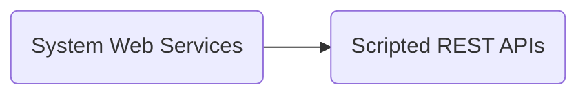

# Servicenow MID Server Scripted Installation on Ubuntu Server
This is an easy way to automate your Servicenow MID Server installation and validation on Ubuntu. If you want to learn more about Servicenow MID Server, please refer to [the official documentation](https://docs.servicenow.com/bundle/utah-servicenow-platform/page/product/mid-server/concept/mid-server-landing.html). 

## Prerequisites

Before starting the installation, you'll need to deploy an Ubuntu Server. I recommend using an official [Ubuntu Cloud Image](https://cloud-images.ubuntu.com/), since it's a quick way to deploy virtual machines in a matter of minutes, avoiding to manage a full installation by yourself. Probably, the full how-to works for Debian as well, although I haven't tested it.

The other prerequisite you need is a working Servicenow instance. It can be a Demohub instance. 

## Optional - Scripted REST API Validation from script
If you want your MID Server to be automatically validated from the script, you have to previously create a Scripted REST API record that lets you do that.  This can be very useful if you need to automate validation for several MID Servers.
In your instance, you have to go to:

Then you have to fill the form with the name and API ID you prefer. For instance, you can use:

|                	|Scripted REST Service      |
|-------------------|---------------------------|
|Name			 	|midvalidate			    |
|API ID	        	|midvalidate		        |
|API ID	         	|midvalidate		        |
|Protection Policy  |None		             	|
|Application        |Global		             	|
|API Namespace      |snc						|

Feel free to change the values in the table above to fit your needs. Once you're done, click on *Submit*. 

Open the record you have just created and in the bottom menu, go to:

Now, we will create the Script that will be executed when the API Method is called:

|                	|API Parameters		        |
|-------------------|---------------------------|
|Name			 	|midvalidate			    |
|HTTP Method       	|POST				        |
|Relative Path     	|midservername		        |

In the Script text box, you'll have to paste the following code:

    (function process(/*RESTAPIRequest*/ request, /*RESTAPIResponse*/ response) {

	    // implement resource here
		var parmvar = request.pathParams;
		var midnamevar = parmvar.midservername;
		(new MIDServerManage()).validate(midnamevar);
	
	})(request, response);

Click *Save* and that's it.

## Installing your MID Server

Once your Ubuntu Server is running, connect via SSH and clone this repository by using the `git` command:

    git clone https://github.com/rafabolivar/servicenow-midinstall.git ~/midserver

Check that your instance Timezone is the same in your Ubuntu Server, otherwise MID Server validation process could get stuck. You can do this in your instance going to:

Edit the variables in the `midinstall.sh` script to fit your needs:

    INSTANCE="<name_of_your_instance>"
    MIDNAME="<name_of_your_midserver>"
    MIDUSER="<name_of_your_miduser>"
    MIDPASSWD="<your_miduser_password>"
    MIDSW="<url_to_download_deb_package_from>"
    MIDGPG="<url_to_download_gpg_key_zip_from>"

You can get the links for the deb package and the GPG key from your Instance, under:

Execute the installation script:

    chmod a+x ~/midserver/midinstall.sh
    ~/midserver/midinstall.sh

The Script will install required tools (if needed), download the MID Server software, install it and validate it with your Instance. Enjoy it.
